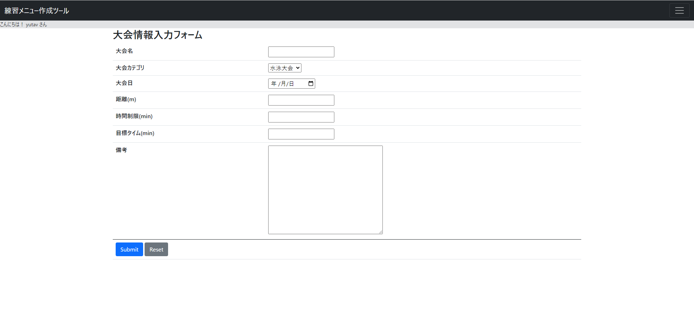
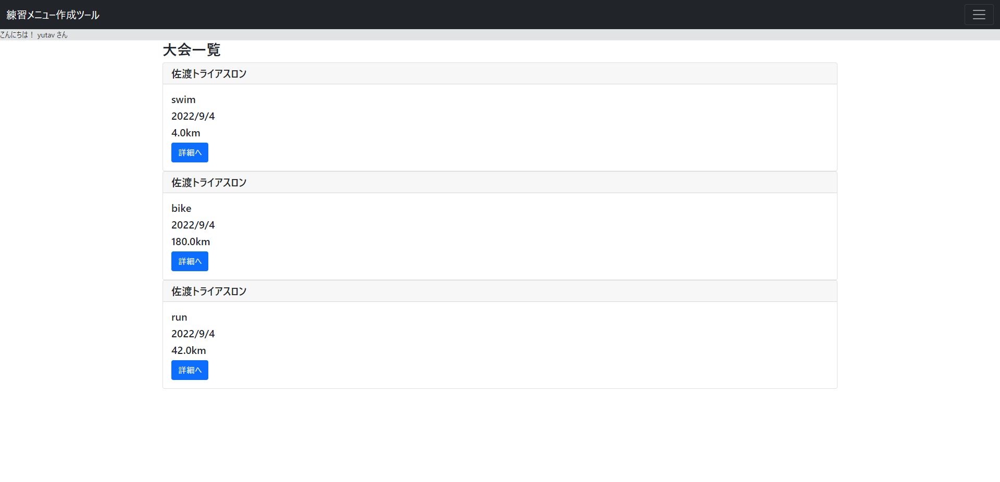
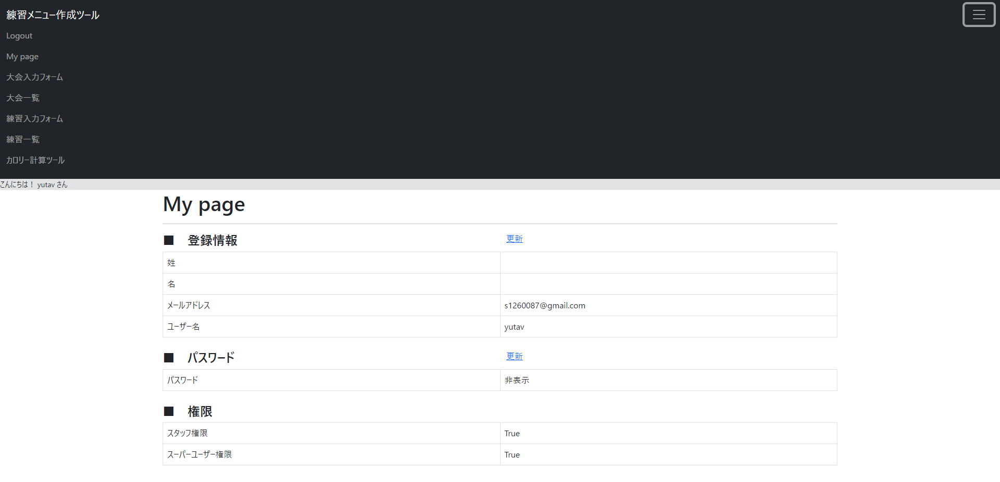

# 練習メニュー作成ツール
 
練習メニューの作成ツールを個人開発で作成しました。

作成の経緯は、私はトライアスロン部に所属していて練習メニュー作成を担当していました。そこで練習メニューを簡単に作成、保存をするための補助ツールがあればいいなと考え作成しました。

使用言語はPythonのDjangoフレームワークです。

URL: https://practicemenu.herokuapp.com/
 
# 概要
 
以下ツールのデモです。

まずここで大会の情報を入力します。

するとここに内容一覧が表示されます。

こちらはMypageとページ一覧です。

# 機能

* ログイン機能
    * サインアップ機能
    * Googleログイン機能
    * ログアウト機能
    * ユーザー情報表示機能
    * ユーザー情報変更機能
* 大会練習メニュー
    * 大会フォーム
    * 大会一覧
        * 投稿削除
        * 投稿編集
    * 練習フォーム
    * 練習一覧
        * 投稿削除
        * 投稿編集
* カロリー計算ツール

# 使い方
 
サインアップかGoogleログインをしてもらい、メニューバーから実行したいことを選択していただき画面に沿って入力してもらう。
 
# 技術的に工夫した点
 
* ログインの部分でサインアップでアカウントを作成するのを省略していただくために、Googleログインを実装した。
* 大会、練習一覧表示の部分で詳細ボタンを作り、備考など詳しい情報にアクセスできるようにした。
* 投稿したものが編集できるように機能を作成した。

# これから改善していく点

* それぞれのユーザーごとにデータベースで情報を扱えるようにもする。
* 画像投稿もできるように改善する。
* 位置情報も入れられるように改善する。
